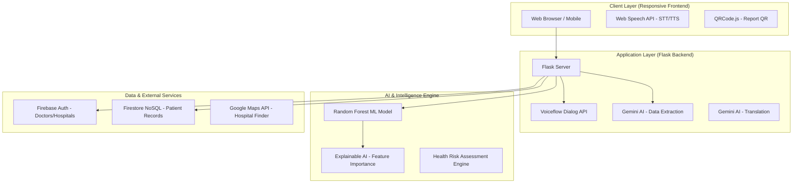

# 🏥 JanArogya AI

**JanArogya AI** is an **AI-powered remote healthcare platform** designed to assist **early disease detection, multilingual health communication, and intelligent risk monitoring**, particularly for **rural and underserved populations**.

The system collects patient health information, analyzes it using **machine learning models and AI services**, predicts possible health risks, and helps hospitals manage patient priority & healthcare resources efficiently.

---
Live Link: https://janarogya-ai.vercel.app/
---

# 🚀 Project Workflow

```
Patient → AI Diagnosis → Risk Prediction → Hospital Workflow → Doctor Dashboard
```

### 1️⃣ Patient Input

Patients provide health data through a web interface or voice interaction.

Information collected:

* Symptoms
* Vital signs
* Basic health history
* Voice queries (via speech interface)

---

### 2️⃣ AI Diagnosis

AI services process patient inputs using:

* **Gemini AI** for data extraction
* **Machine Learning models** for medical analysis
* **Voiceflow Dialog API** for conversational interaction

---

### 3️⃣ Risk Prediction

Machine learning models evaluate the patient condition and classify risk levels:

* 🔴 **Emergency**
* 🟠 **Urgent**
* 🟢 **Routine**

This helps hospitals identify high-risk patients early.

---

### 4️⃣ Hospital Workflow

Hospitals receive structured AI predictions to:

* Prioritize patients
* Optimize healthcare resources
* Improve emergency response

---

### 5️⃣ Doctor Dashboard

Doctors can view:

* Patient health reports
* AI risk predictions
* Patient history
* Hospital recommendations

---

# 🧩 Core Modules

### AI Diagnostic Module

Analyzes symptoms and patient data using machine learning.

### Predictive Risk Engine

Predicts medical risk level using trained models.

### Voice Interaction System

Supports **speech-to-text and text-to-speech** for accessibility.

### Multilingual AI Layer

Uses **AI translation** to support multiple languages.

### Doctor Workflow Dashboard

Provides healthcare professionals with patient insights.

### Privacy & Security Layer

Ensures secure storage and access to patient data.

---

# 🛠 Technology Stack

| Layer                | Technologies                    |
| -------------------- | ------------------------------- |
| **Frontend**         | Web Interface, Web Speech API   |
| **Backend**          | Python, Flask                   |
| **Machine Learning** | Scikit-learn                    |
| **AI Services**      | Gemini AI, Voiceflow Dialog API |
| **Database**         | Firebase Firestore              |
| **Authentication**   | Firebase Auth                   |
| **External APIs**    | Google Maps API                 |
| **Visualization**    | QRCode.js                       |

---

# 🤖 AI & Machine Learning Models

### Random Forest Classifier

Used for **health risk prediction**.

Advantages:

* Handles multiple health features
* High accuracy on structured data
* Robust against overfitting

---

### Explainable AI (XAI)

The system integrates **Explainable AI** to show **feature importance**.

Benefits:

* Doctors understand model decisions
* Transparent medical predictions
* Improved trust in AI systems

---

# 🏗 System Architecture



---

# 📊 Healthcare Motivation

| Metric                      | Explanation                                                                                                                                                                       |
| --------------------------- | --------------------------------------------------------------------------------------------------------------------------------------------------------------------------------- |
| **Doctor Ratio**            | Although the national doctor ratio is around **1:811**, in many rural regions it is estimated to be **close to 1:11,000**, indicating a severe shortage of medical professionals. |
| **Specialist Availability** | Urban hospitals have better specialist access, while **around 80% of specialist positions remain vacant in rural public health centers**.                                         |
| **Diagnostic Access**       | Urban populations have access to private labs, but **less than 40% of rural populations have reliable access to diagnostic facilities**.                                          |
| **Insurance Coverage**      | Despite government schemes covering **about 50% of the population**, many rural patients still rely on **out-of-pocket medical expenses**.                                        |

---

# 📂 Dataset

The system initially uses **public healthcare datasets** for model training and testing.

Datasets include:

* Symptom-disease mapping datasets
* Patient health records datasets
* Medical symptom severity datasets

Official datasets will be provided during the hackathon.

---

# 🎯 Project Goal

Build a **secure AI-powered healthcare system** that enables:

* Early disease risk prediction
* Remote patient monitoring
* AI-assisted hospital workflow
* Multilingual healthcare communication
* Improved healthcare accessibility for rural populations

---

# 🛣 Development Roadmap

### Phase 1

Problem research and system architecture design

### Phase 2

Machine learning model development

### Phase 3

Patient interface and voice interaction implementation

### Phase 4

Doctor dashboard and hospital workflow integration

### Phase 5

System integration, testing, and deployment

---

# 👨‍💻 Team

**HackStorm**
